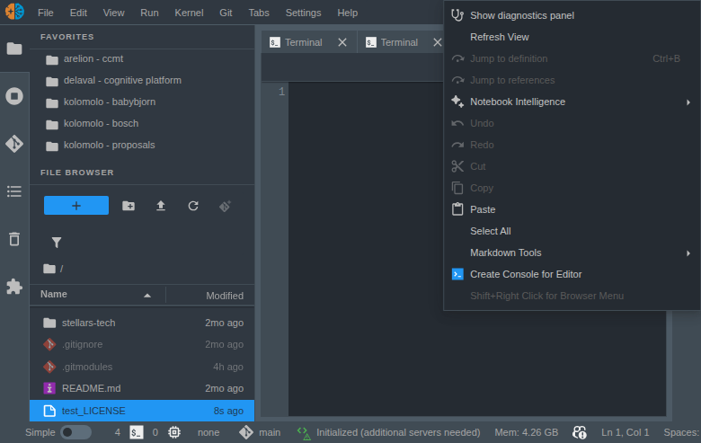
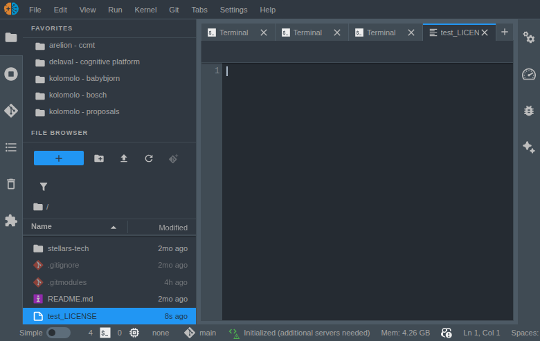

# jupyterlab_other_file_type_menu_fix

[](https://github.com/stellarshenson/jupyterlab_other_file_type_menu_fix/actions/workflows/build.yml)
[](https://www.npmjs.com/package/jupyterlab_other_file_type_menu_fix)
[](https://pypi.org/project/jupyterlab-other-file-type-menu-fix/)
[](https://pepy.tech/project/jupyterlab-other-file-type-menu-fix)
[](https://jupyterlab.readthedocs.io/en/stable/)
[](https://kolomolo.com)
[](https://www.paypal.com/donate/?hosted_button_id=B4KPBJDLLXTSA)

> [!WARNING]
> This extension is a workaround for a JupyterLab core bug. It will be deprecated and removed once the fix is included in an official JupyterLab release. If you are running a JupyterLab version where the context menu works correctly for unregistered file types, you no longer need this extension.

Fixes the broken context menu for non-standard file types in JupyterLab. When you open files like LICENSE, .gitignore, Dockerfile, or any file without a registered type and right-click, the context menu shows stale items from the previously focused widget - items are inert and hover highlighting is broken. This extension forces proper widget activation before the Lumino context menu resolves, ensuring the correct menu appears.

| Without fix                                                | With fix                                             |
| ---------------------------------------------------------- | ---------------------------------------------------- |
|  |  |

## Features

- **Fixes stale context menu** - right-clicking in files without a registered type now shows the correct context menu instead of a repeat of the last valid file's menu
- **Restores menu interactivity** - context menu items are properly connected to the current widget, so clicks actually work
- **Fixes hover highlighting** - menu item hover states render correctly
- **Zero side effects** - does not register new file types or override icons from other extensions (compatible with vscode-icons and similar icon packs)

## Root cause

JupyterLab's document registry maps file extensions to file types via `DocumentRegistry.getFileTypesForPath()`. Files without a recognized extension or name pattern - such as LICENSE, Makefile, or any custom-named file - return an empty match. The file still opens correctly in a FileEditor because the registry falls back to the generic `text` type, but the widget may not be the shell's `currentWidget` when the Lumino context menu fires.

Lumino's context menu resolves which commands to display (and their `isEnabled`/`isVisible` state) against `shell.currentWidget`. If the user right-clicks on an unregistered file type after having focused a different widget, the context menu renders commands for the previous widget. The result is a stale menu with inert items and broken hover highlighting because the command targets don't match the visible editor.

## How it works

The extension registers a `DocumentRegistry.WidgetExtension` on the `'Editor'` factory via `addWidgetExtension()`. This attaches a capture-phase `contextmenu` event listener on every FileEditor widget's own DOM node. When the user right-clicks, the listener calls `shell.activateById()` for that specific widget before the event reaches Lumino's document-level handler. By the time Lumino resolves context menu commands, the correct widget is already active.

This approach is deterministic and widget-scoped - each widget takes responsibility for its own activation rather than relying on a global event interceptor. It does not register file types, so it cannot interfere with icons provided by vscode-icons or other extensions.

## Installation

Requires JupyterLab 4.0.0 or higher.

```bash
pip install jupyterlab_other_file_type_menu_fix
```

## Uninstall

```bash
pip uninstall jupyterlab_other_file_type_menu_fix
```
